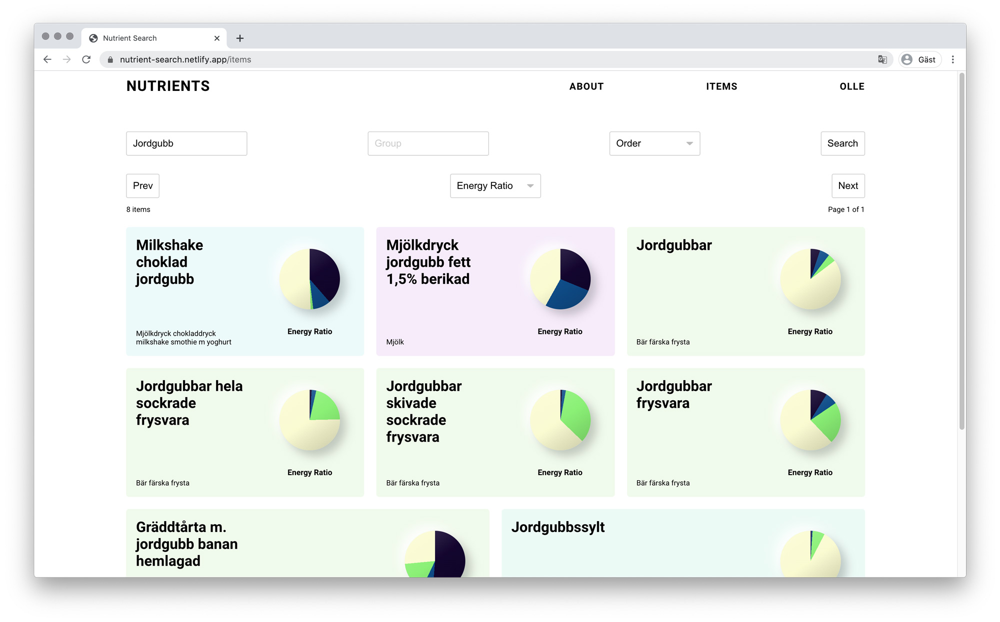

# Final Project – Technigo Bootcamp&ensp;|&ensp;[View Live &#10555;](https://nutrient-search.netlify.app/)

## Nutrient Search 
My final project at the Technigo Bootcamp.
A full MERN Stack web-app to browse, sort, filter and save nutrition data from [Livsmedelsdatabasen](http://www7.slv.se/SokNaringsinnehall). 

## Screenshot

## Backend
https://nutrient-search.herokuapp.com/

## View it live
https://nutrient-search.netlify.app/